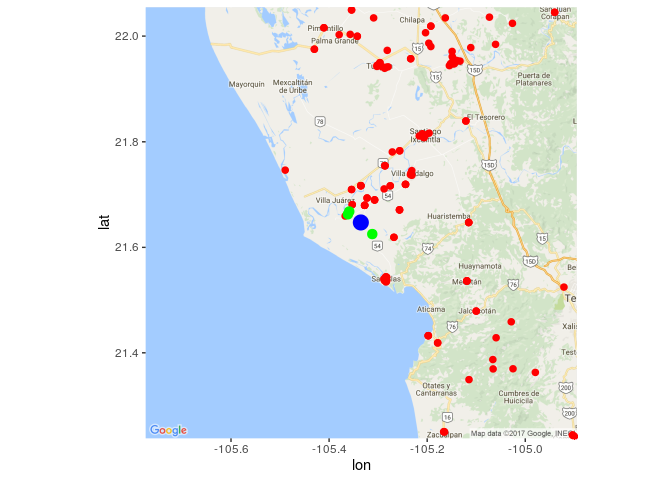

```{r setup, include=FALSE}
knitr::opts_chunk$set(echo = TRUE, warning = FALSE)
setwd('/home/fou/Desktop/Online/RCoursera/R-Coursera/DevDataProducts/')
```

## Previous work and context

In July 2016 in Mexico a call was opened to be part of the first data laboratory to improve the creation and management of public policy, [datalab](https://datos.gob.mx/blog/abrimos-convocatoria-datalab?category=noticias), and I participated. 
Part of the selection process consisted in solving a problem with data. The context of the problem is as follows:

In the prelude to Hurricane [Patricia](https://en.wikipedia.org/wiki/Hurricane_Patricia) in [Nayarit](https://en.wikipedia.org/wiki/Nayarit), a data set  was collected about information of community centers (which serve as an emergency shelter incluying it's spatial location) distributed throughout the entity, data are provided by the institution that made the contest but are available in my [git](https://github.com/fou-foo/DataLab/blob/master/datalab.md) along with the analysis I made (the document is in Spanish), **it's required that anyone can see which community centers are closest to their location.**
An important point of the competition was the visualization of the results, in that time the best visualization that I could did was the following:




Where the blue dot is the location of a person requesting information from the nearest, randomly generated shelters, green spots at the nearest shelters and red spots at other shelters.

Now with the skills learned in this course my challenge is to improve this visualization using the *leaflet* package and the result is the following:

### 29 January 2017
```{r mapaUpdate}
setwd('/home/fou/Desktop/Online/RCoursera/R-Coursera/DevDataProducts')
load(file ="mapaReproducible.Rdata")
names(datos)
library(dplyr)
library(leaflet)
library(htmltools)
datos$Latitud <- datos$Longitud <- NULL
datos$lat <- coord$lat
datos$lng <- coord$lon
persona$lng <- persona$lon 
persona$lon <- NULL
res$lng <- res$lon
res$lon <- NULL
iconos <- makeIcon(iconUrl = 'https://upload.wikimedia.org/wikipedia/commons/thumb/a/a5/CivilDefence.svg/700px-CivilDefence.svg.png',
				   iconWidth = 31*215/(230*2), iconHeight = 31/2,
				   iconAnchorX = 31*215/(230*2*2), iconAnchorY = 16/2)


leaflet(data = datos) %>%
	setView(lng = persona$lng, lat = persona$lat, zoom = 12) %>%
	addProviderTiles("OpenMapSurfer.Roads") %>%
	addProviderTiles("MtbMap") %>%
	addProviderTiles("Stamen.TonerLines",
					 options = providerTileOptions(opacity = 0.35)
	) %>%
	addProviderTiles("Stamen.TonerLabels") %>%
	addMarkers(icon = iconos, clusterOptions = markerClusterOptions(), popup = ~htmlEscape(
																	paste0("Refugio: ", Refugio, ".          ",
																	"Dirección: Municipio", Municipio,", ", Dirección, ".        ",
																	"Tel:", Telefono )	)) %>%
	addCircleMarkers(data = persona,
		color = c("navy"),
		stroke = FALSE, fillOpacity = 0.5
	) %>% 	addCircleMarkers(data = res,
							color = c("red"),
							stroke = FALSE, fillOpacity = 0.5
	)
```


Personally, I consider progress in the visualization, in addition the library _leaflet_ allows integration with _shiny_ so that in the future the map could be included in a web application. This year there will be another call for the second _datalab_ and again I will participate.