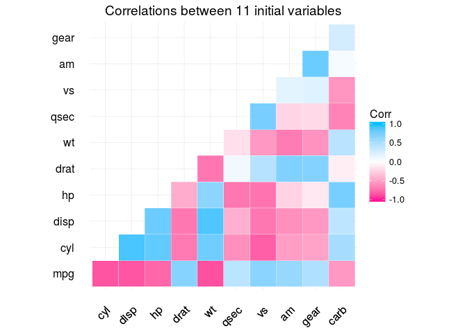
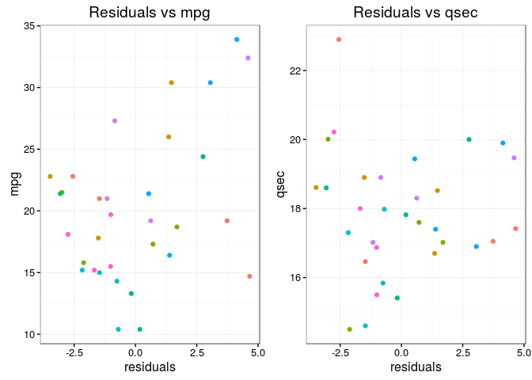

Summary
-------

With the data available from our Motor Trend magazine, the question of
whether the performance of cars is improved by using manual or automatic
transmission is assessed. First, a test of means is evaluated,
indicating that the difference is notorious, then a generalized linear
model is used, showing again the difference between the use of
transmissions and the effect of the choice against the performance of
miles per gallon

Data
----

Data from 32 cars of the models 1973 and 1974 have been collected and
stored in a package of R
[1](http://stat.ethz.ch/R-manual/R-devel/library/datasets/html/mtcars.html),
and the following variables are recorded:

-   *mpg* Miles/(US) gallon  
-   *cyl* Number of cylinders  
-   *disp* Displacement
-   *hp* Gross horsepower
-   *drat* Rear axie ratio
-   *wt* Weight (1000 lbs)
-   *qsec* 1/4 mile time
-   *vs* V/S
-   *am* Transmission (0 = automatic, 1 = manual)  
-   *gear* Number of forward gears
-   *carb* Number of carburetors

Table 1 shows the descriptive statistics of the variables, after coding
some of the variables as categorical. In particular, we are interested
in the relation of the performance by gasoline, since in fact this in
Mexico has just had a considerable increase
[2](http://edition.cnn.com/2017/01/05/americas/mexico-protests-gas-price-hikes/),
which is reflected in the variable mpg with respect to the type of
transmission of the cars.

    cars <- mtcars
    cars <- transform(cars, cyl = factor(cyl), am = factor(am)  )

Introduction
------------

For this reason, we performed a Student t test (since we know neither
the variance nor the population mean) with the following hypothesis:

-   *H*0 The performance of automobiles (mpg) with automatic
    transmission is on average equal to the average performance of cars
    with manual transmission

<!-- -->

    student.test <- t.test(subset(cars, am == 0 )$mpg, subset(cars, am == 1 )$mpg)

So, with a confidence of 95% we reject the previous hypothesis, since
the *p-* value of the test is less than 0.05, in fact it is 0.0013736
and the means are 17.1473684, 24.3923077 for the groups automatic and
manual respectively, so we proceed to fit a multiple regression model
which relates mpg to the other features.

In view of the fact that automobiles have a higher performance of miles
per gallon of gasoline, *mpg* , when they have the manual transmission,
we will try to predict performance depending on the other variables for
which information is available.

As the variable *mpg* has a high linear correlation with the other
variables, as can be seen in figure 2, a first proposed multiple linear
model contemplates all variables, considering *cyl* and *am* as
categorical, The confidence intervals for each of the parameters (in
this saturated model) are as follows:

    model.Saturate <- lm(mpg ~ ., data = cars)
    kable(confint(model.Saturate))

<table>
<thead>
<tr class="header">
<th align="left"></th>
<th align="right">2.5 %</th>
<th align="right">97.5 %</th>
</tr>
</thead>
<tbody>
<tr class="odd">
<td align="left">(Intercept)</td>
<td align="right">-16.1939252</td>
<td align="right">51.8336117</td>
</tr>
<tr class="even">
<td align="left">cyl6</td>
<td align="right">-6.3793748</td>
<td align="right">3.0587613</td>
</tr>
<tr class="odd">
<td align="left">cyl8</td>
<td align="right">-7.3650246</td>
<td align="right">10.6399042</td>
</tr>
<tr class="even">
<td align="left">disp</td>
<td align="right">-0.0223870</td>
<td align="right">0.0502118</td>
</tr>
<tr class="odd">
<td align="left">hp</td>
<td align="right">-0.1027001</td>
<td align="right">0.0104433</td>
</tr>
<tr class="even">
<td align="left">drat</td>
<td align="right">-3.4707456</td>
<td align="right">3.5234462</td>
</tr>
<tr class="odd">
<td align="left">wt</td>
<td align="right">-7.6582776</td>
<td align="right">0.0457824</td>
</tr>
<tr class="even">
<td align="left">qsec</td>
<td align="right">-0.8590047</td>
<td align="right">2.1529189</td>
</tr>
<tr class="odd">
<td align="left">vs</td>
<td align="right">-2.9933241</td>
<td align="right">6.4880979</td>
</tr>
<tr class="even">
<td align="left">am1</td>
<td align="right">-1.5645684</td>
<td align="right">6.7990993</td>
</tr>
<tr class="odd">
<td align="left">gear</td>
<td align="right">-2.2745524</td>
<td align="right">3.8026107</td>
</tr>
<tr class="even">
<td align="left">carb</td>
<td align="right">-1.4565480</td>
<td align="right">2.4752503</td>
</tr>
</tbody>
</table>

Since no interval, with 95% confidence, does not go through zero, we
proceed to discard from the model the variables that present less
[Akaike](https://en.wikipedia.org/wiki/Akaike_information_criterion)
information, and the new model estimade has three parameters,
*α**w**t*, *α**q**s**e**c* and
*α**a**m*1 whose confidence intervals do not pass through
zero, and their values are significant because the three values of the
parameters pass the test *T* of significance
(*p* − *v**a**l**u**e*&lt;0.05) the constant term is decided to include
to maintain a referent when the other variables are zero.:

    model.Baseline <- step(model.Saturate, trace = FALSE)
    library(pander)
    panderOptions("digits", 2)
    pander(summary(model.Baseline))

<table style="width:86%;">
<colgroup>
<col width="25%" />
<col width="15%" />
<col width="18%" />
<col width="13%" />
<col width="13%" />
</colgroup>
<thead>
<tr class="header">
<th align="center"> </th>
<th align="center">Estimate</th>
<th align="center">Std. Error</th>
<th align="center">t value</th>
<th align="center">Pr(&gt;|t|)</th>
</tr>
</thead>
<tbody>
<tr class="odd">
<td align="center"><strong>wt</strong></td>
<td align="center">-3.9</td>
<td align="center">0.71</td>
<td align="center">-5.5</td>
<td align="center">7e-06</td>
</tr>
<tr class="even">
<td align="center"><strong>qsec</strong></td>
<td align="center">1.2</td>
<td align="center">0.29</td>
<td align="center">4.2</td>
<td align="center">0.00022</td>
</tr>
<tr class="odd">
<td align="center"><strong>am1</strong></td>
<td align="center">2.9</td>
<td align="center">1.4</td>
<td align="center">2.1</td>
<td align="center">0.047</td>
</tr>
<tr class="even">
<td align="center"><strong>(Intercept)</strong></td>
<td align="center">9.6</td>
<td align="center">7</td>
<td align="center">1.4</td>
<td align="center">0.18</td>
</tr>
</tbody>
</table>

<table style="width:85%;">
<caption>Fitting linear model: mpg ~ wt + qsec + am</caption>
<colgroup>
<col width="20%" />
<col width="30%" />
<col width="11%" />
<col width="22%" />
</colgroup>
<thead>
<tr class="header">
<th align="center">Observations</th>
<th align="center">Residual Std. Error</th>
<th align="center"><em>R</em>2</th>
<th align="center">Adjusted <em>R</em>2</th>
</tr>
</thead>
<tbody>
<tr class="odd">
<td align="center">32</td>
<td align="center">2.5</td>
<td align="center">0.85</td>
<td align="center">0.83</td>
</tr>
</tbody>
</table>

Conclusion
----------

To diagnose the robustness of the model, the non-correlation of the
residuals with our variables features and *mpg* was verified (both are
small below to .4, see figure 3 ), also a Kolmogorov-Smirnov test was
performed on the residues to contrast the hypothesis that the residues
follow a normal distribution (see table 2).

*In conclusion with the adjusted model, because the coefficient with the
variable *am1* which refers to the manual automobile transimision (due
to encoding of factor type used) has a value of 9.6 we can say that if
the other variables are left fixed An automobile will have an average of
9.6 miles per gallon higher than cars that do not have manual
transmission, this estimate in the difference between the original means
is due in part to the information provided by the variables *wt* and
*qsec* to the model and both are Part of two different components as
mentioned in the legend of figure 2.*

Adjuncts
--------

    kable(summary(cars))

<table>
<thead>
<tr class="header">
<th align="left"></th>
<th align="center">mpg</th>
<th align="left">cyl</th>
<th align="center">disp</th>
<th align="center">hp</th>
<th align="center">drat</th>
<th align="center">wt</th>
<th align="center">qsec</th>
<th align="center">vs</th>
<th align="left">am</th>
<th align="center">gear</th>
<th align="center">carb</th>
</tr>
</thead>
<tbody>
<tr class="odd">
<td align="left"></td>
<td align="center">Min. :10.40</td>
<td align="left">4:11</td>
<td align="center">Min. : 71.1</td>
<td align="center">Min. : 52.0</td>
<td align="center">Min. :2.760</td>
<td align="center">Min. :1.513</td>
<td align="center">Min. :14.50</td>
<td align="center">Min. :0.0000</td>
<td align="left">0:19</td>
<td align="center">Min. :3.000</td>
<td align="center">Min. :1.000</td>
</tr>
<tr class="even">
<td align="left"></td>
<td align="center">1st Qu.:15.43</td>
<td align="left">6: 7</td>
<td align="center">1st Qu.:120.8</td>
<td align="center">1st Qu.: 96.5</td>
<td align="center">1st Qu.:3.080</td>
<td align="center">1st Qu.:2.581</td>
<td align="center">1st Qu.:16.89</td>
<td align="center">1st Qu.:0.0000</td>
<td align="left">1:13</td>
<td align="center">1st Qu.:3.000</td>
<td align="center">1st Qu.:2.000</td>
</tr>
<tr class="odd">
<td align="left"></td>
<td align="center">Median :19.20</td>
<td align="left">8:14</td>
<td align="center">Median :196.3</td>
<td align="center">Median :123.0</td>
<td align="center">Median :3.695</td>
<td align="center">Median :3.325</td>
<td align="center">Median :17.71</td>
<td align="center">Median :0.0000</td>
<td align="left">NA</td>
<td align="center">Median :4.000</td>
<td align="center">Median :2.000</td>
</tr>
<tr class="even">
<td align="left"></td>
<td align="center">Mean :20.09</td>
<td align="left">NA</td>
<td align="center">Mean :230.7</td>
<td align="center">Mean :146.7</td>
<td align="center">Mean :3.597</td>
<td align="center">Mean :3.217</td>
<td align="center">Mean :17.85</td>
<td align="center">Mean :0.4375</td>
<td align="left">NA</td>
<td align="center">Mean :3.688</td>
<td align="center">Mean :2.812</td>
</tr>
<tr class="odd">
<td align="left"></td>
<td align="center">3rd Qu.:22.80</td>
<td align="left">NA</td>
<td align="center">3rd Qu.:326.0</td>
<td align="center">3rd Qu.:180.0</td>
<td align="center">3rd Qu.:3.920</td>
<td align="center">3rd Qu.:3.610</td>
<td align="center">3rd Qu.:18.90</td>
<td align="center">3rd Qu.:1.0000</td>
<td align="left">NA</td>
<td align="center">3rd Qu.:4.000</td>
<td align="center">3rd Qu.:4.000</td>
</tr>
<tr class="even">
<td align="left"></td>
<td align="center">Max. :33.90</td>
<td align="left">NA</td>
<td align="center">Max. :472.0</td>
<td align="center">Max. :335.0</td>
<td align="center">Max. :4.930</td>
<td align="center">Max. :5.424</td>
<td align="center">Max. :22.90</td>
<td align="center">Max. :1.0000</td>
<td align="left">NA</td>
<td align="center">Max. :5.000</td>
<td align="center">Max. :8.000</td>
</tr>
</tbody>
</table>

Table 1: Descriptive statistics of the variables. Note

    cars2 <- mtcars
    library(ggcorrplot)

    ## Loading required package: ggplot2

    r <- cor(mtcars)
    ggcorrplot(cor(mtcars),, title = "Correlations between 11 initial variables",
               colors = c("deeppink", "white", "deepskyblue"),  type = "lower",
               outline.col = "white")

Figure
[2](http://edition.cnn.com/2017/01/05/americas/mexico-protests-gas-price-hikes/):
Correlation between the variables of the data set, note that the
variable *wt* is positively correlated with *hp*, *disp*, *cyl* and
*carb* which reflect directly the weight of the car, this same set of
variables $  {wt, hp, Disp. , Cyl, carb}$ negatively correlate with the
*mpg* variable while the other variables correlate positively with
respect to *mpg*.

    library(RColorBrewer)
    r <- data.frame(res = model.Baseline$residuals, mpg = cars$mpg, qsec= cars$qsec)
    r1 <- round(cor(r$res, r$mpg), 2)
    r2 <- round(cor(r$res, r$qsec), 2) 
    g1 <- ggplot(r, aes(res, mpg)) + geom_point(aes(
        colour = rep(brewer.pal(8, "Set2"),4))) + xlab('residuals') + ylab('mpg') +
        theme_bw() +  ggtitle('Residuals vs mpg') + #xlim(c(0,20))+
        theme(legend.position = "none")
    g2 <- ggplot(r, aes(res, qsec)) + geom_point(aes(
        colour = rep(brewer.pal(8, "Set2"),4))) + xlab('residuals') + ylab('qsec') +
        theme_bw() +  ggtitle('Residuals vs qsec') + #xlim(c(0,20))+
        theme(legend.position = "none")
    multiplot(g1, g2, cols = 2)

Figure 3: Correlation of the residuals with the variable to be predicted
*mpg* (right: correlation = 0.39). Correlation of residues with the
variable *qsec* (left: correlation = 0)

    meanks <-  round(mean(model.Baseline$residuals), 2)
    sdks <- round(sd(model.Baseline$residuals), 2)
    pander(ks.test(model.Baseline$residuals, "pnorm", meanks, sdks))

<table style="width:71%;">
<caption>One-sample Kolmogorov-Smirnov test: <code>model.Baseline$residuals</code></caption>
<colgroup>
<col width="23%" />
<col width="13%" />
<col width="33%" />
</colgroup>
<thead>
<tr class="header">
<th align="center">Test statistic</th>
<th align="center">P value</th>
<th align="center">Alternative hypothesis</th>
</tr>
</thead>
<tbody>
<tr class="odd">
<td align="center">0.15</td>
<td align="center">0.44</td>
<td align="center">two-sided</td>
</tr>
</tbody>
</table>

Table 2: Kolmogorov-Smirnov test on the residuals of the model with
three parameters. The proof that residuals is distributed as a normal
with average 0 (another important assuption ) and 2.34 sd is accepted.
