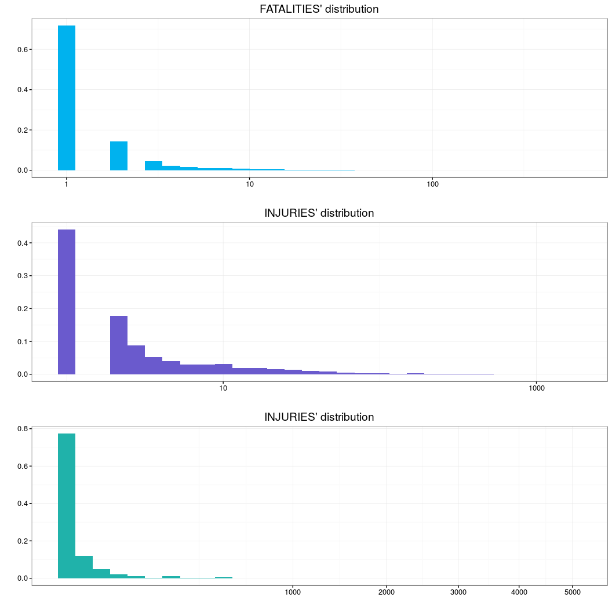
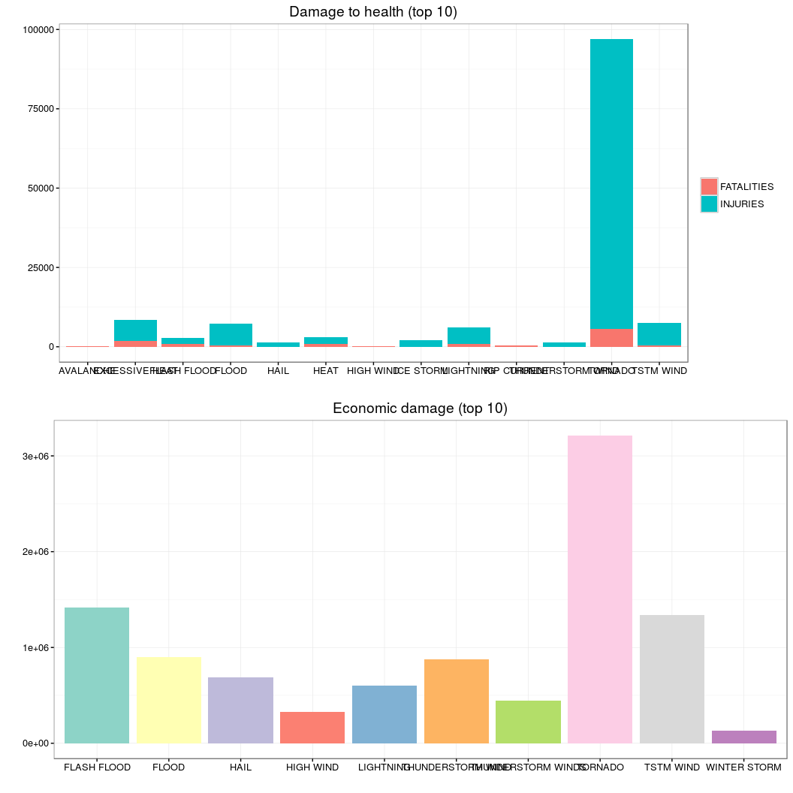

Synopsis
--------

*From a National Weather Service data set, the number of deaths, the number of injuries and the number of properties damaged by different weather phenomena in the U.S. (data from 1950 to November 2011) are analyzed. It is determined which phenomenon has the greatest impact on the health of the population as well as the one that causes greater economic damages.*

Data Processing
---------------

In order to make it simpler to reproduce the following analysis in place of work To work with data that comes from a local .csv file we download directly the data from the url, we unzip it and load it into the environment: [https://d396qusza40orc.cloudfront.net/repdata%2Fdata%2FStormData.csv .bz2](https:%20//%20d396qusza40orc.%20Cloudfront.net/repdata%2Fdata%2FStormData.csv.bz2) using functions from the package 'utils'.

``` r
temp <- tempfile()
download.file('https://d396qusza40orc.cloudfront.net/repdata%2Fdata%2FStormData.csv.bz2',temp) # download data
rawData <- read.csv(bzfile(temp)) # descompress and then read data
```

Using the package 'dplyr' the variables 'EVTYPE' (which indicates the type of severe weather event described in the log such as storm, blizzard heavy snow between others), 'FATALITIES' (number of deaths as a result of the natural phenomenon ), 'INJURIES' (The number of injured as a result of the natural phenomenon) and 'PROPDMG' (a broad estimation about the number of properties and crops damage for the severe weather event -for details see [National Climatic Data Center Storm Events FAQ](https://d396qusza40orc.cloudfront.net/repdata%2Fpeer2_doc%2FNCDC%20Storm%20Events-FAQ%20Page.pdf) was selected. Then we check for missing values.

``` r
library(dplyr)
```

    ## 
    ## Attaching package: 'dplyr'

    ## The following objects are masked from 'package:stats':
    ## 
    ##     filter, lag

    ## The following objects are masked from 'package:base':
    ## 
    ##     intersect, setdiff, setequal, union

``` r
Data <- rawData %>% select(EVTYPE, FATALITIES, INJURIES, PROPDMG)
NAprop <- sum(is.na(Data$PROPDMG))
NAFata <- sum(is.na(Data$FATALITIES))
NAInj <- sum(is.na(Data$INJURIES))
```

And we verify that there are 0, 0 and 0 null values in the variables FALITIES, INJURIES and PROPDMG respectively. Which makes us think of the high quality of the data we work or that the data was tratated before being placed in the url.

``` r
library(dplyr)
Data <- rawData %>% select(EVTYPE, FATALITIES, INJURIES, PROPDMG)
NAprop <- sum(is.na(Data$PROPDMG))
NAFata <- sum(is.na(Data$FATALITIES))
NAInj <- sum(is.na(Data$INJURIES))
```

First let's look at the descriptive statistics of the variables to observe that in the three cases the damages in health and economic are low because the third quantile is close to zero for the three variables, which is good however in figure 1 we can see the distribution of the varibles in the graph 1 it can be seen that there are some cases with high values in each one of the variables.

Also in graph 1 it can be observed that an ***additional transformation is not necessary*** to the variables that we are handling.

``` r
library(xtable)
#print(xtable(summary(Data)), booktabs = TRUE) build the table 
```

\begin{table}[ht]
\centering
\begin{tabular}{rllll}
  \hline
 &               EVTYPE &   FATALITIES &    INJURIES &    PROPDMG \\ 
  \hline
1 & HAIL             :288661   & Min.   :  0.0000   & Min.   :   0.0000   & Min.   :   0.00   \\ 
  2 & TSTM WIND        :219940   & 1st Qu.:  0.0000   & 1st Qu.:   0.0000   & 1st Qu.:   0.00   \\ 
  3 & THUNDERSTORM WIND: 82563   & Median :  0.0000   & Median :   0.0000   & Median :   0.00   \\ 
  4 & TORNADO          : 60652   & Mean   :  0.0168   & Mean   :   0.1557   & Mean   :  12.06   \\ 
  5 & FLASH FLOOD      : 54277   & 3rd Qu.:  0.0000   & 3rd Qu.:   0.0000   & 3rd Qu.:   0.50   \\ 
  6 & FLOOD            : 25326   & Max.   :583.0000   & Max.   :1700.0000   & Max.   :5000.00   \\ 
  7 & (Other)          :170878   &  &  &  \\ 
   \hline
\end{tabular}
\end{table}
Table 1: Descriptive statistics of the variables

``` r
library(ggplot2)
multiplot <- function(..., plotlist=NULL, file, cols=1, layout=NULL) {
  library(grid)
 # Make a list from the ... arguments and plotlist
  plots <- c(list(...), plotlist)
  numPlots = length(plots)
  # If layout is NULL, then use 'cols' to determine layout
  if (is.null(layout)) {
    # Make the panel
    # ncol: Number of columns of plots
    # nrow: Number of rows needed, calculated from # of cols
    layout <- matrix(seq(1, cols * ceiling(numPlots/cols)),
                    ncol = cols, nrow = ceiling(numPlots/cols))
  }
 if (numPlots==1) {
    print(plots[[1]])
  } else {
    # Set up the page
    grid.newpage()
    pushViewport(viewport(layout = grid.layout(nrow(layout), ncol(layout))))
    # Make each plot, in the correct location
    for (i in 1:numPlots) {
      # Get the i,j matrix positions of the regions that contain this subplot
      matchidx <- as.data.frame(which(layout == i, arr.ind = TRUE))
      print(plots[[i]], vp = viewport(layout.pos.row = matchidx$row,
                                      layout.pos.col = matchidx$col))
    }
  }
}
p1 <-ggplot(Data, aes(x = FATALITIES)) + geom_histogram(aes(y = ..count../sum(..count..)), 
                                                        fill = 'deepskyblue2') +
    ggtitle("FATALITIES' distribution") + ylab('')+ xlab('') +theme_bw() +
    scale_x_log10()
p2 <-ggplot(Data, aes(x = INJURIES)) + geom_histogram(aes(y = ..count../sum(..count..)), 
                                                      fill = 'slateblue') + 
    ggtitle("INJURIES' distribution") + ylab('')+ xlab('') +theme_bw() + scale_x_log10()
p3 <- ggplot(Data, aes(x = PROPDMG)) + geom_histogram(aes(y = ..count../sum(..count..)),
                                                      fill = 'lightseagreen') +
    ggtitle("INJURIES' distribution") + ylab('')+ xlab('') +theme_bw() + scale_x_sqrt()
multiplot(p1,p2,p3)
```

    ## `stat_bin()` using `bins = 30`. Pick better value with `binwidth`.

    ## Warning: Removed 895323 rows containing non-finite values (stat_bin).

    ## `stat_bin()` using `bins = 30`. Pick better value with `binwidth`.

    ## Warning: Removed 884693 rows containing non-finite values (stat_bin).

    ## `stat_bin()` using `bins = 30`. Pick better value with `binwidth`.


*Figure 1:Distribution of the variables: FATALITIES, INJURIES and PROPDMG in the dataset. We can notice that the tails are not heavy but they are important.*

Results
-------

After determining the top ten phenomena with the highest number of deaths and the top ten phenomena with the greatest number of injured, it was found that the intersection of both sets is large (first seven elemenths), as can be seen in the upper part of figure 2. It is Easy to distinguish Tornados from the most harmful events for population health followed by Excessive heat and Lightings.

On the other hand the events of severe climate with greater economic consequences along the US are, once again, the Tornados this majority is marked with respect to the other phenomena, followed by Flash Flood and Thunderstorm wind, as can be seen in Graph 2 (below).

``` r
fata <- Data %>% group_by(EVTYPE) %>% summarise(suma = sum(FATALITIES) ) %>%
    arrange(desc(suma)) %>% filter(row_number()<11)
fata$tipo <- 'FATALITIES'
inj <- Data %>% group_by(EVTYPE) %>% summarise(suma = sum(INJURIES) ) %>%
    arrange(desc(suma)) %>% filter(row_number()<11)
inj$tipo <- 'INJURIES'
prop <- Data %>% group_by(EVTYPE) %>% summarise(suma = sum(PROPDMG) ) %>%
    arrange(desc(suma)) %>% filter(row_number()<11)
prop$tipo <- 'PROPDMG' 
p <- rbind(fata, inj)
r1 <-ggplot(p, aes(EVTYPE, suma, fill = factor(tipo))) + geom_bar(stat = 'identity') + ylab('')+  xlab('') +theme_bw()+guides(fill=guide_legend(title=NULL)) + ggtitle('Damage to health (top 10)') #http://www.cookbook-r.com/Graphs/Legends_(ggplot2)/
library(RColorBrewer)
r2 <- ggplot(prop, aes(EVTYPE, suma)) + geom_bar(stat = 'identity',fill = brewer.pal(dim(prop)[1], "Set3")) + ylab('') + xlab('') + theme_bw() +  ggtitle('Economic damage (top 10)') 
multiplot(r1, r2)
```


*Figure 2: (Top) Number of injured persons (blue) and number of deaths (pink) probed by the ten phenomena with greater presence in the U.S. (Bottom) The ten phenomena with greater number of properties and crops damage in the U.S.*