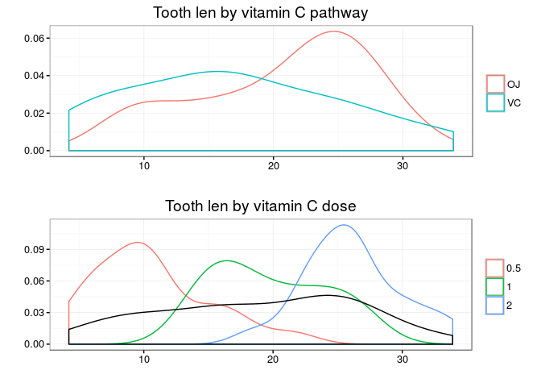

The dataset (ToothGrowth)
-------------------------

The set of "data sets" contains data sets used to make examples, in
particular it contains the famous set
[Iris](https://en.wikipedia.org/wiki/Iris_flower_data_set) that was used
by Fisher to exemplify and develop various statistical themes

On the other hand in this exercise we use the dataset
[ToothGrowth](http://stat.ethz.ch/R-manual/R-devel/library/datasets/html/ToothGrowth.html)
which registers the response to the length of the cells
[odontoblasts](https://en.wikipedia.org/wiki/Odontoblast), which are
responsible for the production of the substance
[dentin](https://en.wikipedia.org/wiki/Dentin) for tooth growth, In 60
Guinea pigs who Received three different doses of vitamin C administered
in two forms (orange juice and ascorbic acid).

So, we load the dataset...

    library(datasets)
    data <- ToothGrowth

Exploratory analysis
--------------------

The descriptive statistics of the variables in our data set are shown in
Table 1. The descriptive statistics of the variables in our dataset are
shown in Table 1.

    kable(summary(data))

<table>
<thead>
<tr class="header">
<th align="left"></th>
<th align="center">len</th>
<th align="left">supp</th>
<th align="center">dose</th>
</tr>
</thead>
<tbody>
<tr class="odd">
<td align="left"></td>
<td align="center">Min. : 4.20</td>
<td align="left">OJ:30</td>
<td align="center">Min. :0.500</td>
</tr>
<tr class="even">
<td align="left"></td>
<td align="center">1st Qu.:13.07</td>
<td align="left">VC:30</td>
<td align="center">1st Qu.:0.500</td>
</tr>
<tr class="odd">
<td align="left"></td>
<td align="center">Median :19.25</td>
<td align="left">NA</td>
<td align="center">Median :1.000</td>
</tr>
<tr class="even">
<td align="left"></td>
<td align="center">Mean :18.81</td>
<td align="left">NA</td>
<td align="center">Mean :1.167</td>
</tr>
<tr class="odd">
<td align="left"></td>
<td align="center">3rd Qu.:25.27</td>
<td align="left">NA</td>
<td align="center">3rd Qu.:2.000</td>
</tr>
<tr class="even">
<td align="left"></td>
<td align="center">Max. :33.90</td>
<td align="left">NA</td>
<td align="center">Max. :2.000</td>
</tr>
</tbody>
</table>

Table 1: Note the distribution of the vitamin C pathway, 30 individuals
with orange juice (OJ) and 30 individuals given ascorbic acid (VC).

It is also worth noting the distribution of doses in the table, as can
be seen in Table 2. Each group of the form of administration of vitamin
C (OJ or VC) has 10 individuals to whom 0.5 or 1 or 2 mg / day, We would
say it was a well-designed experiment.

    kable(table(data$supp, data$dose))

<table>
<thead>
<tr class="header">
<th align="left"></th>
<th align="right">0.5</th>
<th align="right">1</th>
<th align="right">2</th>
</tr>
</thead>
<tbody>
<tr class="odd">
<td align="left">OJ</td>
<td align="right">10</td>
<td align="right">10</td>
<td align="right">10</td>
</tr>
<tr class="even">
<td align="left">VC</td>
<td align="right">10</td>
<td align="right">10</td>
<td align="right">10</td>
</tr>
</tbody>
</table>

Table 2: Distribution of the individuals in the sample by vitamin C
pathway and dose.

On the other hand, in figure 1 (upper) is the distribution of the length
of the teeth, in the sample, in the function of the administration route
and also in figure 2 (down) is the distribution of the length Of the
teeth depending on the dose administered.

Figure 1: Tooth length distribution (upper) by pathway and (down) dose.

Hypothesis tests
----------------

We first used a student t test to contrast the hypothesis that the mean
length of the cells in the sets formed by individuals to which the
administration of vitamin C per juice is *equal* to the group given
ascorbic acid.

    t.test(len ~ supp, data = data)

    ## 
    ##  Welch Two Sample t-test
    ## 
    ## data:  len by supp
    ## t = 1.9153, df = 55.309, p-value = 0.06063
    ## alternative hypothesis: true difference in means is not equal to 0
    ## 95 percent confidence interval:
    ##  -0.1710156  7.5710156
    ## sample estimates:
    ## mean in group OJ mean in group VC 
    ##         20.66333         16.96333

Since the $ p-value $ of the test is greater than 0.05 then the **null
hypothesis** that both groups have the same mean **is not rejected**,
although this variable is distributed differently as we can see in
figure 1 (upper), *so that in the context of the problem both
administration routes showed similar results in terms of tooth growth*.

We now perform a Student's t test to test the hypothesis that the dose
of vitamin C administered has the same results in the group receiving
0.5 mg / day and the group receiving 1 mg / day in tooth growth.

    t.test(len ~ supp, data = subset(data, dose %in% c(0.5,1) ))

    ## 
    ##  Welch Two Sample t-test
    ## 
    ## data:  len by supp
    ## t = 3.0503, df = 36.553, p-value = 0.004239
    ## alternative hypothesis: true difference in means is not equal to 0
    ## 95 percent confidence interval:
    ##  1.875234 9.304766
    ## sample estimates:
    ## mean in group OJ mean in group VC 
    ##           17.965           12.375

In this case, the $ p-value $ of the test is less than 0.05, thus
rejecting the hypothesis that the length of the teeth is the same in
both groups with a confidence of 0.95%. Then we repeated the test for
the groups that received 1 mg / day and 2 mg / day

    t.test(len ~ supp, data = subset(data, dose %in% c(1,2) ))

    ## 
    ##  Welch Two Sample t-test
    ## 
    ## data:  len by supp
    ## t = 1.8397, df = 31.273, p-value = 0.07533
    ## alternative hypothesis: true difference in means is not equal to 0
    ## 95 percent confidence interval:
    ##  -0.3166175  6.1666175
    ## sample estimates:
    ## mean in group OJ mean in group VC 
    ##           24.380           21.455

In this case, since $ p-value $ is less than 0.05, we do not reject the
hypothesis that both groups have the same mean for the variable that
measures the length of the teeth. As we can see in Figure 2 (below) the
group receiving 1 mg / day has a less different distribution than the
group receiving 2 mg / day (as they share the mean) with respect to the
group receiving 0.5 mg / day Because with this does not share the
average).

Conclusion
----------

The route of administration does not affect the growth of the guinea
pigs' teeth, this may be orange juice or ascorbic acid, however the dose
does affect the average length, in the group where 2 mg / day was
administered Greater growth however this is very similar to that of the
group that only received 1 mg / day
