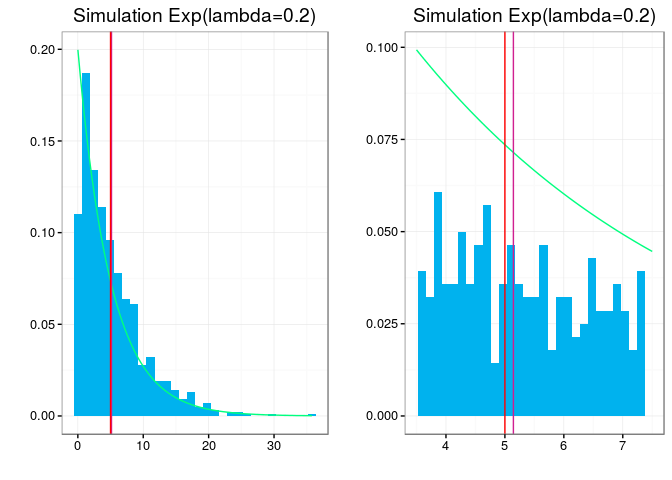
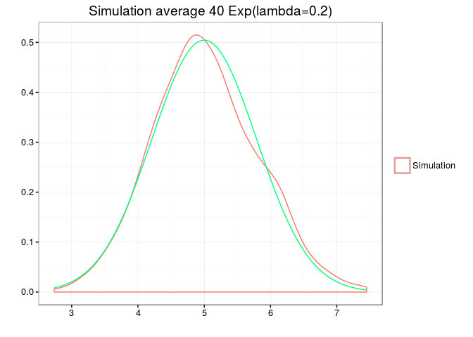

Introduction and overview: Exponential distribution
---------------------------------------------------

In this exercise we will perform some simulation of variables with
exponential distribution and verify the CLT.

The density function of exponential distribution is given by:

*f*(*x*)=*λ**e*−*λ**x*, ∀*λ* ≥ 0

And it's cumulative distribution function is:

∫*λ* ≥ 0*λ**e*−*λ**x* = 1 − *e**λ**x*

And this distribution has many applications in the survival analysis,
such as lifetimes and even in industrial statistics (including software
development) [1](https://en.wikipedia.org/wiki/Survival_analysis)

Sample mean and variance
------------------------

Let's first simulate a thousand random variables
*x* ∼ *E**x**p*(*λ* = 0.2), let's to fix the seed for reproducibility.

    set.seed(176325)
    simula <- rexp(1000,0.2)
    simula <- as.data.frame(simula)
    sampleMean <- mean(simula$simula)
    sampleVar <- var(simula$simula)
    g1 <- ggplot(simula, aes(simula)) + geom_histogram(aes(y = ..count../sum(..count..)),
                                                          fill = 'deepskyblue2') +
        ggtitle("Simulation Exp(lambda=0.2)") + ylab('')+ xlab('') +theme_bw() + 
    stat_function(fun = dexp, colour = "springgreen", args = 0.2) + 
        geom_vline( xintercept = sampleMean, color = 'violetred') +
        geom_vline( xintercept = 1/0.2, color = "red")  
    g2 <- ggplot(simula, aes(simula)) + geom_histogram(aes(y = ..count../sum(..count..)),
                                                          fill = 'deepskyblue2') +
        ggtitle("Simulation Exp(lambda=0.2)") + ylab('')+ xlab('') +theme_bw() + 
    stat_function(fun = dexp, colour = "springgreen", args = 0.2) + 
        geom_vline( xintercept = sampleMean, color = 'violetred') +
        geom_vline( xintercept = 1/0.2, color = "red") + xlim(c(3.5,7.5)) 
    multiplot(g1,g2, cols = 2)

    ## `stat_bin()` using `bins = 30`. Pick better value with `binwidth`.
    ## `stat_bin()` using `bins = 30`. Pick better value with `binwidth`.

Figure 1: (Right) Distribution of the simulated sample. (Left) Zoom on
the sample mean, in color violet and theoretical mean (
$\\frac{1}{\\lambda}=5$ ) in color red.

As we can see in figure 1, the sample mean of the thousand simulations
is very close to the theoretical average 5.1441005 as well as the sample
variance 22.7015545 Which, for this distribution, coincide and are
$\\frac{1}{\\lambda}=5$ and $(\\frac{1}{\\lambda})^{2}=25$ respectively.

Central limit theorem
---------------------

Let's check the CLT by simulating a thousand averages of 40 random
variables *x* ∼ *E**x**p*(0.2)

    set.seed(176325)
    simula <- function(lambda)
    {
        sim <- rexp(40,0.2)
        return(c(mean(sim), var(sim)))
    }
    simulation <- mapply(simula,rep(0.2,1000))
    simulation <- as.data.frame(t(simulation))
    names(simulation) <- c("means", "var")
    means <- mean(simulation$means)
    vars <- var(simulation$means)
    lambda <- .2

    #simulation <- simulation %>% mutate( score = (means-beta) / ( beta /sqrt(40)))
    ggplot(simulation, aes(means)) + geom_density(aes(colour = 'Simulation') )+
        ggtitle("Simulation average 40 Exp(lambda=0.2)") + ylab('')+ xlab('')  + 
    stat_function(fun = dnorm, colour = "springgreen", args =  c(1/lambda, 1/lambda/sqrt(40))) +
    theme_bw()+theme(legend.title=element_blank())

Figure 2: Distribution of a thousand averages *E**x**p*(0.2)

The average of the simulation is of 5.0168566 while its standard
deviation is of 0.6297759 so we can see in the figure 2 the simulated
sample approaches well to a distribution
$N (\\frac{1}{\\lambda}=5, \\frac{ \\frac{1} {\\lambda}}{\\sqrt {40}}=0.7905694$
( figure 2 green).
